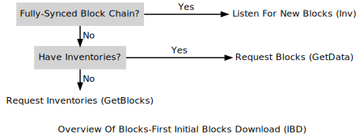

# Peer To Peer Communications
## Introduction
A Peer-to-peer (P2P) network utilises a distributed architecture approach that partitions tasks between peers.  All peers on a network are equal; this means they all perform the exact same function and are both a client and server with regards to data transfer and propagation.

So what do the different P2P networks types look like [^2]:

### Centralised (A)
The centralised model takes the form of your typical client/server model where you have numerous clients all trying to connect to a centralised resource.  An example of this would be users browsing a website (the web browser is the client and web server is the.. server).

### Decentralised (B)
A decentralised network operates on a similar concept to its Centralised predecessor, however instead of having a central focal server which clients attempt to connect.  There are multiple servers that are separated (e.g. geotropically) where clients are able to connect to any available server.  This increases the fault-tolerance and load distribution, however the server's are still centralised and prone to attacks such as Denial of Service.

An example of such an implementation would be to upload a static website to a CDN network.  In which case the CDN nodes are geographically distributed, web clients will then access the closest CDN node.

### Distributed (C)
In Distributed networks all peers/nodes are treated equally; this means they act as both the client and server.  Peers will maintain a connection list of other peers on the network. The client aspect will query each connected peer for additional information (e.g. what's your block height?) where as the server aspect of a peer would process the request then respond with the relevant data (e.g. I am on block 1337, here is the block).

All peers (lets ignore light clients for a moment) on the network will have a copy of data, this means the network is extremely resilient to fault tolerant events that may occur (e.g. such as a DOS attack).

## Purpose
The most important part of a P2P network is the communication between nodes.  Blockchain data is considered secure because every node (ignoring light clients [^4] & sharding [^5] for now) on the network should have a copy of data; nodes would have a constant need to communicate with each other in order to keep data/events (such as blocks or new transactions) synchronised across the network.  As such, the distributed network described above seems like the most logical choice [^1].

P2P protocols should also ensure not only the availability of on-chain data but also the availability of nodes on the network.  This means a connecting client should be able to obtain enough information about the network; it can do so by querying only a small number of online nodes [^2].

Running a node/peer can be costly from a resource (person-hours/CPU/RAM/HDD) perspective.  To encourage network participants, each network has introduced incentives for performing these vital network functions.  In the case of cryptocurrency, such incentives would take the form of being awarded an allocation of coins for performing a network function (e.g. such as producing a new block);  this provides economic incentives to further strengthen the network.

## ###Data Security / Consensus
......ss.s.s.s..s.s.s.
Maybe provide a very brief writeup and link to the main consensus section elsewhere in the book?

## Functions
Peers within a blockchain network all have a number of specific/critical functions to perform.  These same functions would also be targeted by would-be attackers; attempting to compromise or disrupt the network.

It should be noted that each respective project might implement their own protocol/functions.  An example of which is Bitcoin [^1] and Ethereum [^8]; they are completely different where the underlying P2P protocol is not compatible.  This book has started with high-level Bitcoin because thats the easiest to understand (it will also cover Ethereum topics, this is a WIP). 

How do you work out what protocol the chain is using?

There a number of methods you could employ to find this information, such as:
+ Read white/yellow paper
+ Project technical documentation
+ Join project chat site (e.g. Discord/Telegram)
  + Find devs and ask nicely
+ Read The Code
+ Google for prior work/research

Should there still be gaps after exhausting the above methods then it may be possible to attempt `Protocol Reverse Engineering` [^9].  The reader should be warned, this is a deeply technical and time consuming process/route.

### Connecting To Peers (Peer Discovery)
Connecting to peers is one of the most critical aspects of a P2P network;  if your a newly created node, how does that node know where to connect and how to obtain information?

In most instances a node will first attempt to utilise [DNS seed nodes](DNS.md) where a pre-defined list of domains/hosts will be queried.  In a similar fashion, a list of static IP addresses can be hardcoded into the node, and can also be used should the host system not have functioning DNS.

It would also be possible to manually specify IP addresses within the node configuration file; this would permit the node to only talk to trusted nodes [^2].

What sort of things happen once a node is connected? It would query its connected nodes for:

+ List of Other Peers
+ Current Block Height
+ Current Mempool (Uncommitted Transactions)

As a newly connecting node it would be possible to query any node on the network and receive this information.  This could then be performed recursively in order to build up a bigger topological picture and to further mature/establish links into the network [^1].

Once the node has built up sufficient knowledge (e.g. peer list, current block height) it will then start the process of `Initial Block Download` or will sync its current records utilising a similar process.

### Initial Block Download (IBD)
After peer discovery has been performed and a number of connections have been established to the network, it is time for the node to start syncronising with the network.  So what does this mean exactly?

In order for the node to verify unconfirmed transactions they require a full copy of the blockchain; this means the node has to establish the height (current block number) of the chain and to then fill in any missing blocks until said node has caught up with the network.  At present there are two ways of performing an IBD, these are outlined below [^2].

**Note:** For specific protocol related messages (such as `Inv`, `GetData`, `GetHeaders`, `Get Blocks`) please refer to this resource for more techincal information [^3].

#### Headers First
Headers first is the newer and primary method of the two IBD options, since the introduction of `Bitcoin Core v0.10.0`;  the primary goal of this method is to permit fast syncronisation between nodes.

This is achieved by only downloading block headers instead of full blocks, as each header is downloaded, limited validation processes are performed to ensure the header integrity before moving onto the next block header.  Once all headers have been downloaded the node will then start to request full blocks from the network [^1].  

The flowchart below illustrates this process [^1]:

#### Blocks First
The 'blocks first' IBD was the first method used by clients to syncronise to the network; this method will attempt to sequentially download all blocks starting from the previous state (e.g. if its a new node, then last stored block would be 0/Empty) [^1].  This approach is more simplistic than its `Headers First` counterpart. However, there are actually more scenarios that could negatively impact the node becoming operational.  These will be discussed in more detail in the next [P2P Attack section](./P2P_Attack.md).  However, the general gist is this method is more resource intensive and slower compared to the `Headers First` approach.

The flowchart below illustrates the blocks first IBD process [^1]:

### Broadcasting Information
Once a new event (such as a block or transaction) occurs, it must be shared with the network as a whole.  P2P networks achieve this through broadcasting information, unsolicited throughout the network. The p2p protocol will have a defined workflow or set of responses for each message (in technical speak, a protocol state machine [^6]) that will be followed.

This state machine is in essence a set of rules that govern how information/messages are distributed throughout the network [^2].  The set of rules (state machine) and the structure of information (e.g. protocol messages) varies between different chains (as discussed at the start of functions section). 

These rules, while they differ between chains. They all have the same purpose of `Ensuring all messages reach all nodes within a certain time period` and can even govern the order and time delay of such messages [^2].  Everything is built on-top of this protocol layer, given that its unsolicited and unauthenticated; presents an opportunity to identify not only vulnerabilities but also new and exciting ways in which the protocol can be protected (maybe a protocol IDS?).

### Broadcasting Transactions/Memory Pool
It could be argued that this also comes under `Broadcasting Information` however i am giving its own section due to the importance of this piece of functionality.  The network as a whole will maintain a list of transactions to be included onto blocks within the chain.  Once added, they are then removed from the (mempool) list.  Think of this mempool (Memory Pool) as a train station, random people queue for a regular periodic train, once a train stops, people board the carriages and the cycle continues[^11].

This list is in a constant state of flux and as such is generally stored in memory (non-persistent storage) as a low latency approach. However, the cost, is a requirement to have complete knowledge of the chain;  Without knowledge of the previous states, it would not be possible to determine whether the transactions are valid (e.g. a consensus rule where a node is required to validate a transaction upon receiving and before adding to the mempool list).

Chain sizes can also be of a considerable size. Bitcoin for example, currently (June 2022) has a ledger size of 400+ GB [^10].  That could be a problem if you want to run a node on your mobile phone, do you have enough space, ram, cpu?

#### Simple Payment Verification (SPV)
Enter Simple Payment Verification (SPV) as a possible solution, how may you ask? 

To create a transaction, this only requires your private key.  You could even store this transaction in an email or text file (it is signed so you wont be able to modify the transaction, however i would still caution and treat the data as sensitive).  This transaction data could then be broadcast to the network at a different location, this would require you to run a node or rely on a third party to provide the services.  

SPV clients are able to verify whether a transaction has been added to the blockchain by inspecting values such as the merkel root hashes in the block headers [^13].  This means they either require a local copy of the chain headers or will have to rely on a third party providing the services. Here be dragons [^12].

I would argue web3 (json-rpc) has become the natural extension of the original SPV concept (will discuss more in next chapter).

Hopefully some of the above made you pause, yes its possible to use the chain ecosystem without running a full node.  There, are, however.. risks! 

On to the attack section!

[^1]: Bitcoin Developer: P2P Network
  https://developer.bitcoin.org/devguide/p2p_network.html
[^2]: Horizen Academy: P2P - peer-to-peer network
  https://academy.horizen.io/technology/advanced/a-peer-to-peer-p2p-network/
[^3]: Bitcoin: Protocol Documentation
  https://en.bitcoin.it/wiki/Protocol_documentation
[^4]: Ethereum: Light client
  https://geth.ethereum.org/docs/interface/les
[^5]: What Is Blockchain Sharding?
  https://101blockchains.com/what-is-blockchain-sharding/
[^6]: UML Protocol State Machine Diagrams
  https://www.uml-diagrams.org/protocol-state-machine-diagrams.html
[^8]: Ethereum: The RLPx Transport Protocol
  https://github.com/ethereum/devp2p/blob/master/rlpx.md
[^9]: Reverse Engineering Network Protocols
  https://jhalon.github.io/reverse-engineering-protocols/
[^10]: Bitcoin Blockchain Size
  https://ycharts.com/indicators/bitcoin_blockchain_size
[^11]: Mastering the Mempool: Your Intro to In-Flight Transactions
  https://www.blocknative.com/blog/mempool-intro
[^12]: Why Every Bitcoin User Should Understand “SPV Security”
  https://medium.com/@jonaldfyookball/why-every-bitcoin-user-should-understand-spv-security-520d1d45e0b9
[^13]: Merkle Trees and SPV
  https://craigwright.net/blog/bitcoin-blockchain-tech/merkle-trees-and-spv/